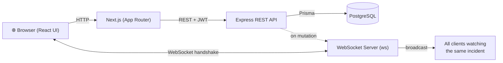

# Disaster Relief Coordination Platform

When a disaster strikes, response is often slowed by scattered spreadsheets and
phone trees: no shared view of what's happening, who's doing what, or which
supplies are still available — and information goes stale the moment it's
written down. This platform is a single real-time coordination hub where
responders log incidents on a live map, organize the work as a drag-and-drop
task board, and track relief resources from *available* to *dispatched*. Every
change is pushed instantly over WebSockets to everyone watching the same
incident, with role-based access separating admins (who create incidents and
dispatch resources) from volunteers (who pick up and progress tasks).

## Architecture



- **Request path:** the browser loads the UI from **Next.js**, which calls the
  **Express REST API**; the API reads/writes **PostgreSQL** through Prisma.
- **Real-time path:** the browser also opens a **WebSocket** connection. When a
  task or resource changes via the REST API, the server **broadcasts** the event
  to every connected client subscribed to that incident.

## Features

- **Real-time task board** — drag tasks between `OPEN` / `IN_PROGRESS` / `DONE`
  columns; updates broadcast live to everyone viewing the incident.
- **Geospatial incident map** — active incidents plotted as colored markers
  (red = active with high-priority tasks, amber = active, green = resolved) with
  click-through popups.
- **Role-based access** — JWT auth with `ADMIN` vs `VOLUNTEER` roles gating
  privileged actions (creating incidents, updating status, dispatching).
- **Resource dispatch tracking** — assign relief resources to responders and
  track their status from `AVAILABLE` to `DISPATCHED`.

## Setup

```bash
git clone <repo-url>
cd Disaster-Relief-Coordination-Platform
cp .env.example .env      # then fill in values (DB creds, JWT_SECRET, Mapbox token)
docker compose up --build
```

This starts three services:

- **client** — Next.js UI at http://localhost:3000
- **server** — Express API + WebSocket at http://localhost:4000
- **postgres** — PostgreSQL at localhost:5432 (the server waits for it to be
  healthy, then runs `prisma migrate deploy` automatically)

Add a `NEXT_PUBLIC_MAPBOX_TOKEN` to `.env` to enable the map and location
geocoder. (If you previously ran a `postgres:16` image, run `docker compose down -v`
once — the old data volume isn't compatible with `postgres:15`.)

## Tech Stack

- **Next.js** — React framework (App Router) serving the client UI
- **TypeScript** — end-to-end type safety across client and server
- **Express** — REST API server
- **Prisma** — type-safe ORM and database migrations
- **PostgreSQL** — relational data store
- **WebSockets** (`ws`) — real-time event broadcasting
- **Mapbox GL** (`react-map-gl` + `@mapbox/search-js-react`) — interactive map and geocoding
- **dnd-kit** — drag-and-drop task board
- **JWT** (`jsonwebtoken` + `bcryptjs`) — authentication and password hashing
- **Docker** — containerized services via Docker Compose

---

## API reference

REST routes require `Authorization: Bearer <token>`; request bodies are
validated with [zod](https://zod.dev/) (`400` with field details on failure).

| Method & path                     | Access       | Description                                     |
| --------------------------------- | ------------ | ----------------------------------------------- |
| `POST /auth/register`             | public       | Create a user, returns user + JWT               |
| `POST /auth/login`                | public       | Verify credentials, returns user + JWT          |
| `POST /incidents`                 | ADMIN        | Create an incident                              |
| `GET /incidents`                  | any auth     | List active incidents (with rollup counts)      |
| `GET /incidents/map`              | any auth     | Active incidents as a GeoJSON FeatureCollection |
| `GET /incidents/:id`              | any auth     | Incident with its tasks & resources             |
| `PATCH /incidents/:id/status`     | ADMIN        | Update incident status                          |
| `POST /incidents/:id/tasks`       | any auth     | Create a task under the incident                |
| `PATCH /tasks/:id`                | any auth     | Update a task's status and/or assignee          |
| `POST /incidents/:id/resources`   | any auth     | Add a resource to the incident                  |
| `PATCH /resources/:id/dispatch`   | any auth     | Assign a resource to a user (DISPATCHED)        |

### Real-time updates

Connect to `ws://localhost:4000/ws`, then send a JSON handshake to authenticate
and subscribe to an incident:

```json
{ "token": "<JWT>", "incident_id": "<incident id>" }
```

The server validates the JWT and registers the socket under that incident.
`PATCH /tasks/:id` and `PATCH /resources/:id/dispatch` then broadcast
`{ type, entity, data }` events to all subscribers of that incident.

## Local development (without Docker)

```bash
npm install                                # installs all workspaces
cp .env.example .env
docker compose up -d postgres              # just the database
npm run prisma:migrate --workspace server  # apply migrations
npm run dev:server                         # http://localhost:4000
npm run dev:client                         # http://localhost:3000
```

| Command           | Description                    |
| ----------------- | ------------------------------ |
| `npm run dev`     | Run all workspaces in dev mode |
| `npm run build`   | Build all workspaces           |
| `npm run lint`    | Lint/type-check all workspaces |
